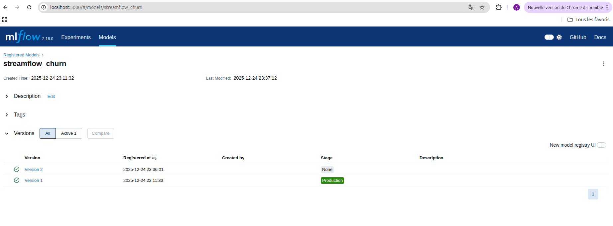
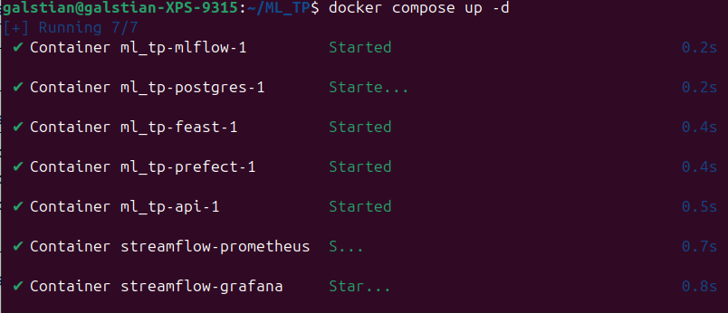
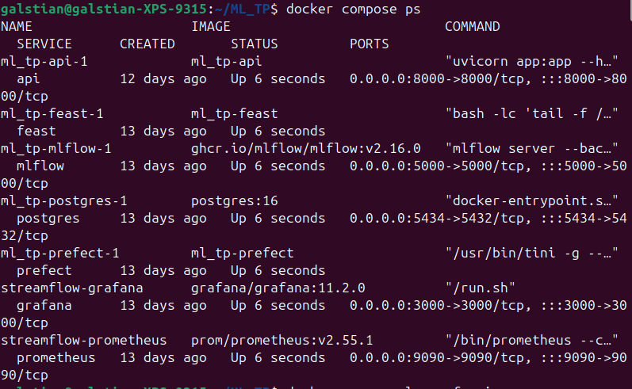
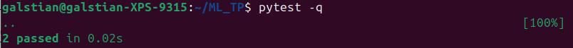
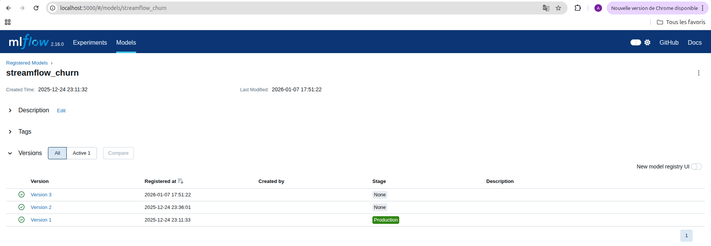
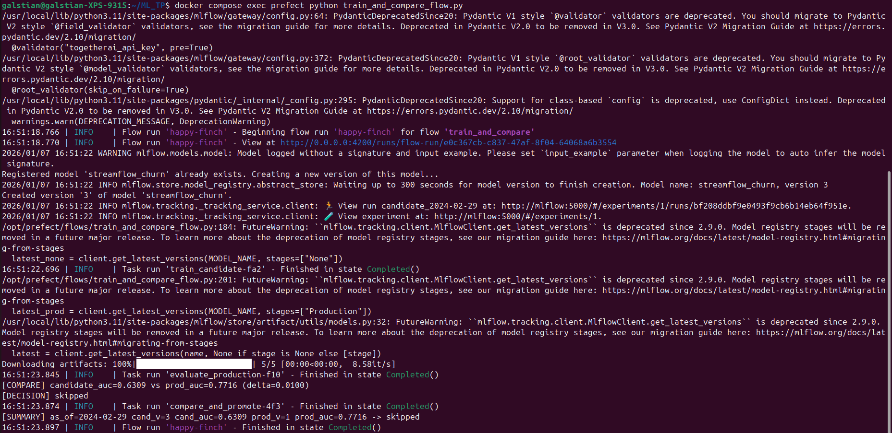
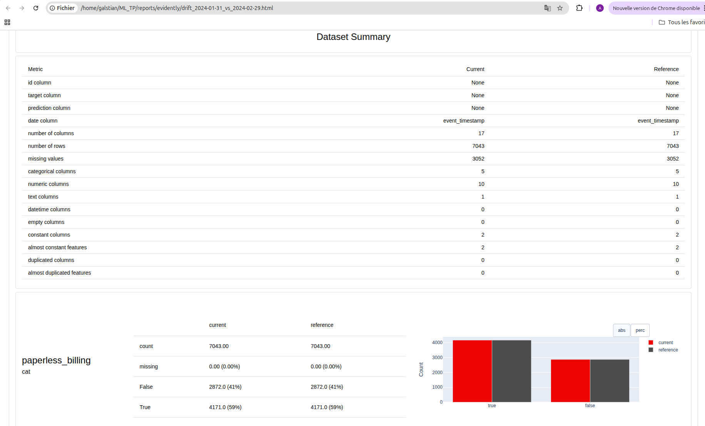
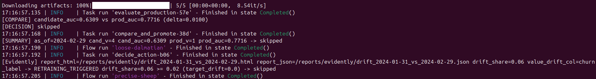
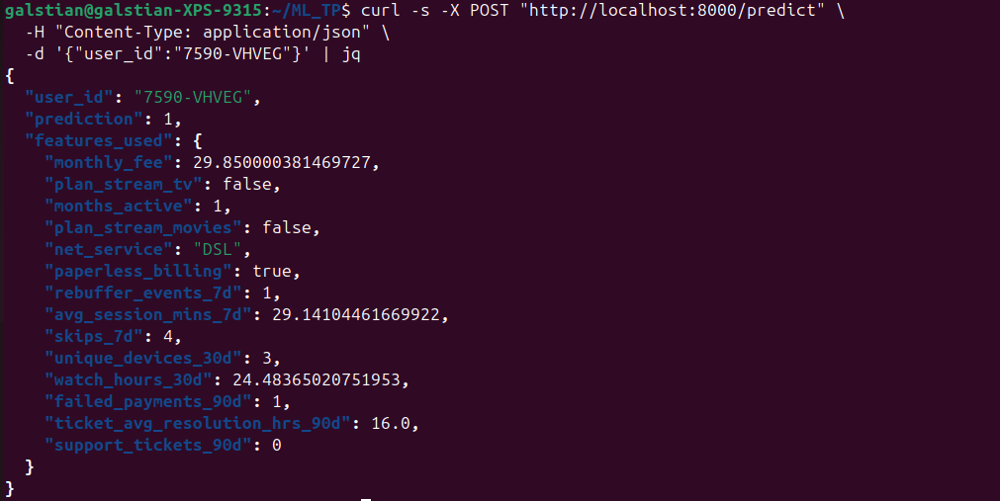
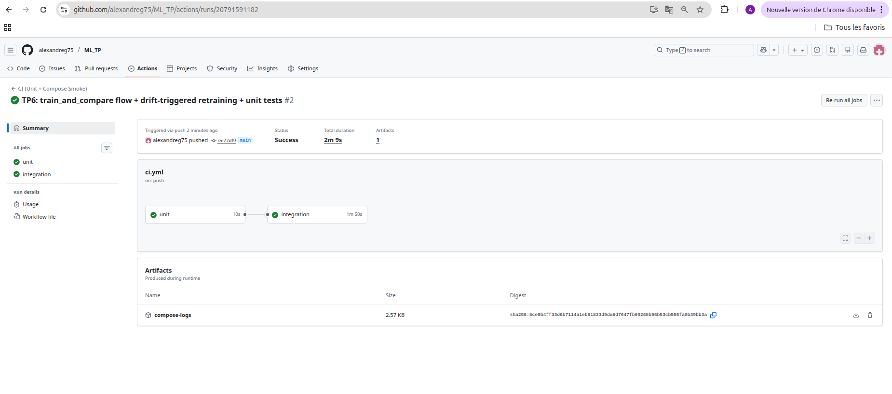

TP 6 - Machine Learning

Question 1 :

Capture MLflow montrant la version Production au début du TP :

Screens terminal montrant docker compose up -d et docker compose ps :

Question 2 :

Screen terminal montrant pytest -q :

On extrait une fonction pure (should_promote) afin de pouvoir tester la logique de décision indépendamment de Prefect, MLflow ou de l’environnement Docker. Cela permet d’avoir des tests unitaires simples, rapides, déterministes et faciles à maintenir.

Question 3 :

Capture MLflow montrant le résultat avec une nouvelle version créée (stage None). Le modèle Production reste le premier 1 (toujours en Production, pas archivé) : 

Screen des logs du flow : 

Le flow a entraîné un modèle candidat sur as_of=2024-02-29 et l’a comparé au modèle Production sur le même split de validation.
Le candidat obtient AUC=0.6309, alors que le modèle en Production est à AUC=0.7716.
Comme le candidat n’est pas meilleur de delta=0.01, la décision est skipped (pas de promotion).

Le delta, lui, est utilisé pour éviter de promouvoir un modèle sur une amélioration trop faible qui peut venir du hasard (bruit, split, ...) : on impose un gain minimum avant de changer la Production.

Question 4 : 

Capture d'un extrait du rapport Evidently HTML :

Screenshot de logs montrant le message RETRAINING_TRIGGERED ... et le résultat promoted/skipped :

Question 5 :

Screenshot du curl montrant la réponse JSON :

L’API doit être redémarrée car elle charge le modèle MLflow (models:/streamflow_churn/Production) au démarrage : si une nouvelle version a été promue en Production, le redémarrage est nécessaire pour que le service recharge cette nouvelle version en mémoire.

Question 6 : 

Capture GitHub Actions montrant un run qui passe :

On démarre Docker Compose dans la CI pour faire un smoke test d’intégration : on vérifie que plusieurs services (Postgres/Feast/MLflow/API) se lancent correctement ensemble et que l’API répond au /health, ce qu’un simple test unitaire ne peut pas garantir.

Question 7 :

Dans ce projet, le drift des données est mesuré à l’aide d’Evidently en comparant deux périodes (month_000 comme référence et month_001 comme période courante). Evidently calcule notamment la proportion de features dont la distribution a significativement changé, appelée drift_share. Un seuil de 0.02 est utilisé pour déclencher automatiquement un réentraînement : cela permet de détecter rapidement une dérive dans ce TP, même si en pratique un seuil plus élevé serait nécessaire pour éviter des réentraînements trop fréquents.

Lorsque le drift dépasse ce seuil, le flow train_and_compare_flow est déclenché par Prefect. Ce flow entraîne un modèle candidat sur les données récentes, calcule ses métriques de validation (notamment val_auc), puis évalue le modèle actuellement en Production sur les mêmes données. La décision de promotion repose sur une règle simple : le modèle candidat est promu uniquement si son AUC dépasse celle du modèle Production d’au moins un delta fixé (par exemple 0.01). Cette logique est isolée dans une fonction pure testable (should_promote), ce qui rend la décision robuste et vérifiable.

Dans cette architecture, Prefect est responsable de l’orchestration métier : détection du drift, entraînement, évaluation, comparaison et promotion du modèle dans MLflow. GitHub Actions, de son côté, gère la CI : exécution des tests unitaires, démarrage de la stack via Docker Compose et vérification que l’API est fonctionnelle. Les deux outils sont donc complémentaires : Prefect pilote le cycle de vie du modèle, tandis que GitHub Actions garantit la qualité et l’intégration du code.

Pour les limites et améliorations possibles, la CI ne doit pas entraîner le modèle complet, car l’entraînement est coûteux, long et potentiellement non déterministe. Elle doit rester rapide et fiable.
Certains tests manquent encore, notamment des tests d’intégration plus poussés sur les flows Prefect et des tests de non-régression sur les métriques du modèle.
Enfin, en conditions réelles, une approbation humaine est souvent nécessaire avant la promotion d’un modèle en Production, pour des raisons de gouvernance, de conformité ou d’impact métier, même si la décision automatique est techniquement correcte.
